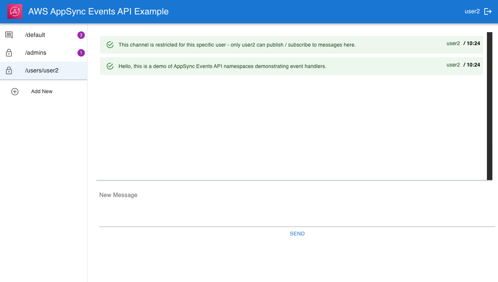
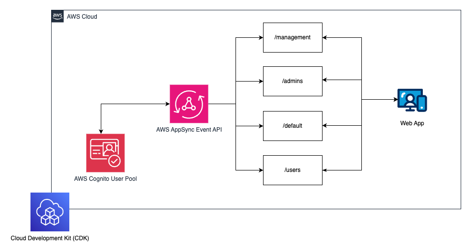
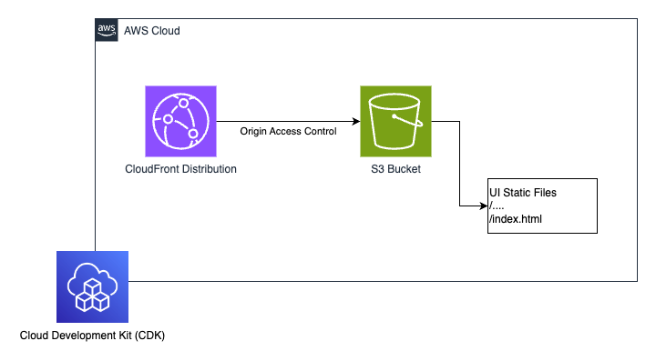
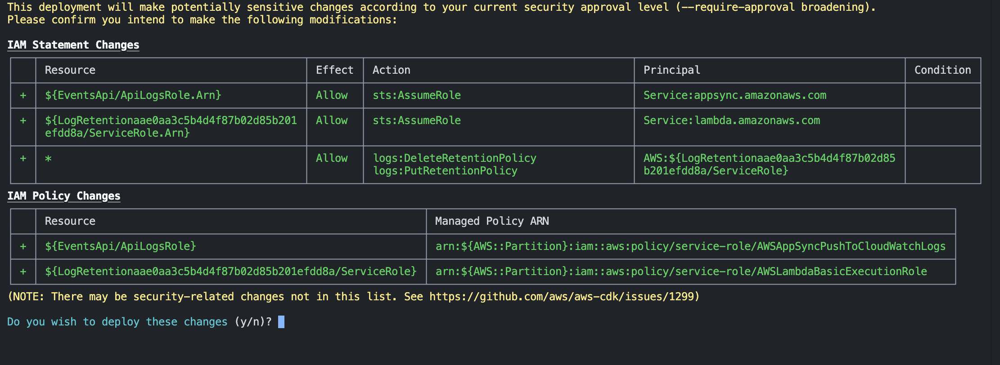
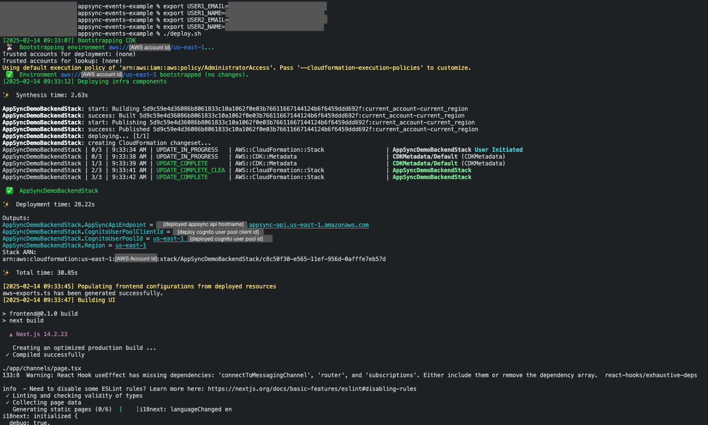
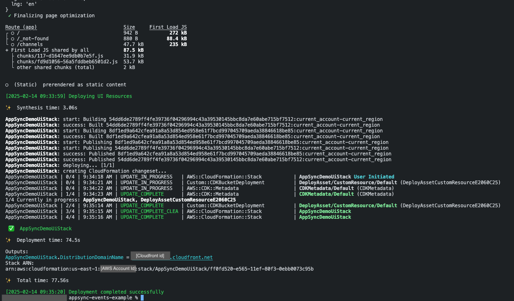
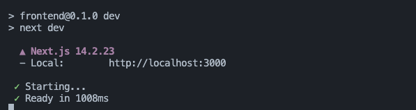

# Sample of Real-Time Messaging using AWS AppSync Events

## Overview

This application demonstrates a frontend UI and enables connected clients to exchange messages in real time through **AWS AppSync Events**. The solution is built with AWS AppSync Events for Backend and Amazon CloudFront for UI Deployment. Users can easily experiment with real-time event data broadcasting. The system is configured to use **Amazon Cognito User Pool** for authorization. It is important to note that the code in this repository is purely for demonstrative purposes and is not intended for production use. 



## Key Features

The project supports various use cases through different namespaces:

- **Default Namespace**: Any authorized user can subscribe to or publish messages to any channel under the default namespace `/default/*`.
- **Management Namespace**: Used for broadcasting management events, such as channel creation and deletion, to keep the user interface updated.
- **Admins Namespace**: An event handler allows any valid user to subscribe to a channel, but only users assigned to the Cognito User Pool group `admins` can publish messages.
- **Users Namespace**: Each user has an exclusive channel name /users/`[username]`. Only the user matching the `[username]` can subscribe/publish messages on this channel. Other users can neither subscribe nor broadcast messages on the channel dedicated to the other users.


The project creates 2 users: `User1` and `User2`. Upon deployment, you have to specify the names and emails for both users (check deployment instructions below). User1 will be assigned to `admins` Cognito User Pool Group, and will have permission to publish messages to `Admins` namespace. User2 will not be assigned to any Cognito User Pool Group, and will have permissions of an authenticate user described above.


## Architecture

The architecture consists of two main components:

1. **Frontend**: A React/Next.js based user interface.
2. **Infra**: Deployed using AWS Cloud Development Kit (CDK), which includes:
   - Cognito User Pool
   - AppSync Event API
   - Channel namespaces
   - Hosting via CloudFront and S3

#### Backend Stack Diagram


#### UI Stack Diagram


## Getting Started

### Prerequisites

- AWS CLI installed/configured.
- Node.js and npm installed.
- CDK cli installed


### Installation

```bash
./install.sh
```

### Deployment Instructions

To deploy the project, substitute the values in square bracket placeholders with your own values. Choose valid values for `[user1-name]`, `[user1-email]`, `[user2-name]`, and `[user2-email]`. Upon deployment user1 and user2 will receive emails with temporary credentials to the specified `[user1-email]` and `[user2-email]` email addresses.
After putting the right values, run the commands below:

```bash

export USER1_NAME=[user1-name]
export USER1_EMAIL=[user1-email]

export USER2_NAME=[user2-name]
export USER2_EMAIL=[user2-email]

./deploy.sh
```

Once you run `deploy.sh` the prompt will ask you to review and approve CDK IAM changes which will be done on your AWS specified account. Once reviewed, approve the changes, to continue deployment.




The `deploy.sh` script performs the following tasks:

- Deploys the backend using CDK.
- Populates UI configuration in `frontend/aws-exports.ts`.
- Builds the frontend using `npm run build`.
- Deploys the UI using CloudFront and S3.





### Uninstall
From the root project directory, run command. This command will destroy both AppSyncDemoUiStack and AppSyncDemoBackendStack cloudformation stacks.
```bash

export USER1_NAME=[user1-name]
export USER1_EMAIL=[user1-email]

export USER2_NAME=[user2-name]
export USER2_EMAIL=[user2-email]

cd ./infra && cdk destroy --all
```

### Accessing the Application

After deployment, navigate to the CloudFront URL provided in the output of the `./deploy.sh` script. You will receive an email containing a temporary password for the specified user email. Use this temporary password to log in; you will be prompted to reset it upon first login.

For additional users, create them using the AWS Cognito User Pool console.

## Usage Scenarios

1. **Publishing Messages**: Users can publish messages to channels within their authorized namespaces.
2. **Subscribing to Channels**: Users can subscribe to channels and receive real-time updates based on their permissions.
3. **Management Events**: Automatically receive updates on channel management activities.

## Authorization and Security

The project leverages Amazon Cognito for authentication, allowing for group-based access control. The following authorization types are implemented:

- **Cognito User Pools**: Enforces group-based access control, allowing only specific users (e.g., admins) to perform certain actions.


## Running Locally
While you still have to deploy the backend stack to run AppSync Event API, you may want to deploy the UI locally so you can develop and test your changes. This can be done as follows:
```bash
cd ./infra && cdk deploy AppSyncDemoBackendStack
cd ./frontend && npm run dev
```


## Conclusion

This example serves as a practical introduction to AWS AppSync Event APIs, showcasing its capabilities in building real-time applications with robust security features. By following the provided instructions, users can deploy their own instance and explore various functionalities of the Event APIs.

For further details on AWS AppSync Events, refer to [AWS Documentation](https://docs.aws.amazon.com/appsync/latest/eventapi/event-api-welcome.html).
